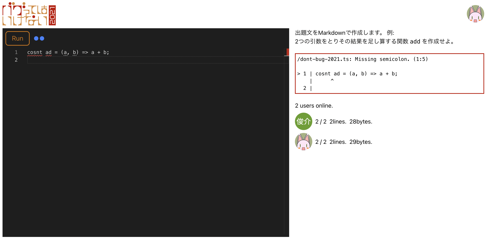

# バグってはいけない2021

> 酒飲みながらコーディングとか執筆したりする、酒もくもく会をやりたいお気持ち表明（もちろんノンアルコール・ソフドリもうぇるかむ）

> 泥酔ハッカソンの機運

> コンパイルエラーとかバグだしたらショット一杯w

> バグってはいけない2021

という馬鹿話をとある執筆者コミュニティでしてて、ちょっと思いつきをプロトタイプしたやつ

## 仕様

* 出題文が表示される
* コーディングエディタで TypeScript を書く
* 実行ボタンを押すと、出題に沿ったコードが書かれているかテストされて、実行結果が表示される
  - コードの実行は一応 sandbox で行われているが、安全性はあまり検証されてないのでイタズラ禁止。
  - コード結果が failed だったら全力で煽られる（予定）
* 参加者のリアルタイムステータスが表示される

## 動かし方

Firebase で Google Auth と Realtime Database を有効にして設定を `.env.local` に書き出して、いい感じに `yarn dev` とか `npm run dev` する。

## 予定

2022年になってもこのリポジトリとソフト名は「バグってはいけない2021」

そもそも、試しに作ってみた感じなので、もう少し真面目に作り直す予定。

## ライセンス

BSD style とかそういうの。あとで真面目に書く。

### 「バグってはいけない2021」ロゴ

[mottox2神](https://twitter.com/mottox2)が提供してくれた。感謝しかない。
